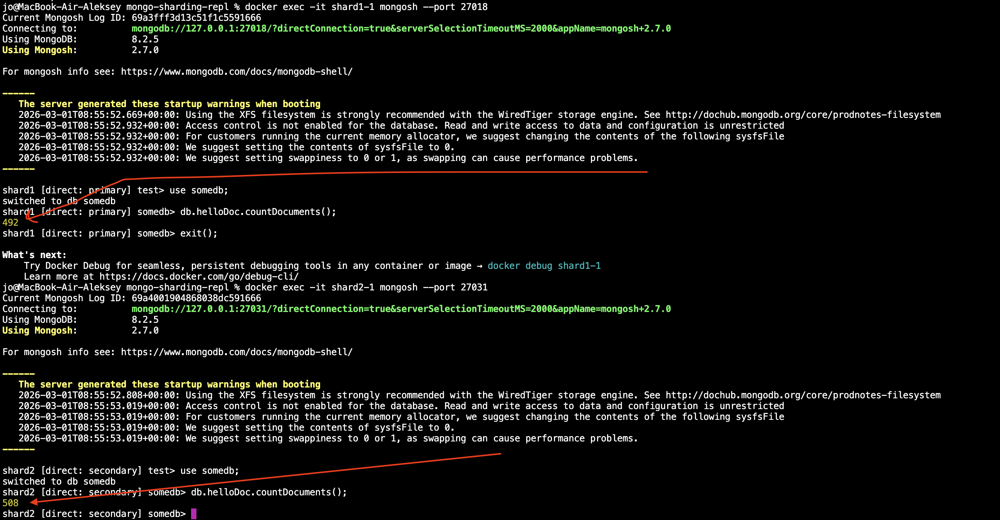

# mongo-sharding

## Как запустить

```shell
docker compose -f compose.yaml up -d
```

командой ps можно получить расположение сервисов на портах:
```shell
mongo-sharding-repl % docker compose -f compose.yaml ps                          
NAME            IMAGE                             COMMAND                  SERVICE         CREATED              STATUS              PORTS
configSrv       mongo:latest                      "docker-entrypoint.s…"   configSrv       About a minute ago   Up About a minute   0.0.0.0:27020->27020/tcp, [::]:27020->27020/tcp
mongos_router   mongo:latest                      "docker-entrypoint.s…"   mongos_router   About a minute ago   Up About a minute   0.0.0.0:27017->27017/tcp, [::]:27017->27017/tcp
pymongo_api     mongo-sharding-repl-pymongo_api   "uvicorn app:app --h…"   pymongo_api     About a minute ago   Up About a minute   0.0.0.0:8080->8080/tcp, [::]:8080->8080/tcp
shard1-1        mongo:latest                      "docker-entrypoint.s…"   shard1-1        About a minute ago   Up About a minute   0.0.0.0:27018->27018/tcp, [::]:27018->27018/tcp
shard1-2        mongo:latest                      "docker-entrypoint.s…"   shard1-2        About a minute ago   Up About a minute   0.0.0.0:27021->27021/tcp, [::]:27021->27021/tcp
shard1-3        mongo:latest                      "docker-entrypoint.s…"   shard1-3        About a minute ago   Up About a minute   0.0.0.0:27022->27022/tcp, [::]:27022->27022/tcp
shard2-1        mongo:latest                      "docker-entrypoint.s…"   shard2-1        About a minute ago   Up About a minute   0.0.0.0:27031->27031/tcp, [::]:27031->27031/tcp
shard2-2        mongo:latest                      "docker-entrypoint.s…"   shard2-2        About a minute ago   Up About a minute   0.0.0.0:27032->27032/tcp, [::]:27032->27032/tcp
shard2-3        mongo:latest                      "docker-entrypoint.s…"   shard2-3        About a minute ago   Up About a minute   0.0.0.0:27033->27033/tcp, [::]:27033->27033/tcp
```

Для инициализации БД запускаем скрипт
```shell
./mongo-init.sh
```

проверяем кол-во документов:
