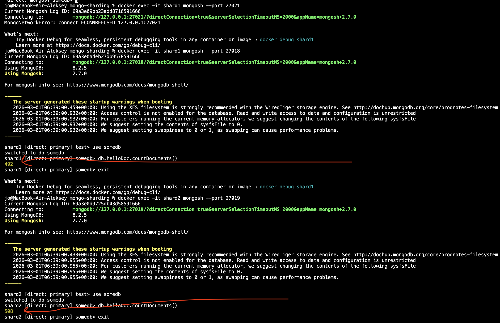

# mongo-sharding

## Как запустить

```shell
docker compose -f compose.yaml up -d
```

командой ps можно получить расположение сервисов на портах:
```shell
mongo-sharding % docker compose -f compose.yaml ps
NAME            IMAGE                        COMMAND                  SERVICE         CREATED          STATUS          PORTS
configSrv       mongo:latest                 "docker-entrypoint.s…"   configSrv       21 seconds ago   Up 20 seconds   0.0.0.0:27020->27020/tcp, [::]:27020->27020/tcp
mongos_router   mongo:latest                 "docker-entrypoint.s…"   mongos_router   21 seconds ago   Up 20 seconds   0.0.0.0:27017->27017/tcp, [::]:27017->27017/tcp
pymongo_api     mongo-sharding-pymongo_api   "uvicorn app:app --h…"   pymongo_api     3 days ago       Up 20 seconds   0.0.0.0:8080->8080/tcp, [::]:8080->8080/tcp
shard1          mongo:latest                 "docker-entrypoint.s…"   shard1          21 seconds ago   Up 20 seconds   0.0.0.0:27018->27018/tcp, [::]:27018->27018/tcp
shard2          mongo:latest                 "docker-entrypoint.s…"   shard2          21 seconds ago   Up 20 seconds   0.0.0.0:27019->27019/tcp, [::]:27019->27019/tcp
```

Для инициализации БД запускаем скрипт
```shell
./mongo-init.sh
```

проверяем кол-во документов:
